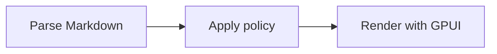
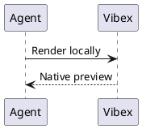

# Advanced Markdown Fixture

[TOC]

Inline math $E = mc^2$, <kbd>Ctrl</kbd> + <kbd>K</kbd>, and <mark>highlighted text</mark>.[^source]

> [!NOTE]
> The canonical document keeps source ranges and stable node identities.

$$
\int_0^1 x^2\,dx = \frac{1}{3}
$$





## Code and diff

```rust
pub fn bounded(value: usize, limit: usize) -> usize {
    value.min(limit)
}
```

```diff
diff --git a/src/lib.rs b/src/lib.rs
index 1111111..2222222 100644
--- a/src/lib.rs
+++ b/src/lib.rs
@@ -1,2 +1,2 @@
-const LIMIT: usize = 16;
+const LIMIT: usize = 32;
```

    let indented_code = true;

## Semantic blocks

> [!TIP]
> Keep one parser and one resource policy.

> [!IMPORTANT]
> Generated SVG crosses a strict sanitizer boundary.

> [!WARNING]
> Unsupported syntax remains readable source.

> [!CAUTION]
> Private Markdown is never sent to a remote renderer.

Term
: A definition rendered by the native document view.

- [x] Parse canonical IR
- [x] Sanitize generated SVG
- [ ] Inspect the final preview

| Surface | Renderer | Policy |
| :-- | :--: | --: |
| Agent timeline | Native GPUI | Shared |
| File preview | Native GPUI | Shared |

<details open>
<summary>Safe disclosure</summary>
<p>Disclosure state survives rerenders while this node remains stable.</p>
<progress value="2" max="3">2 / 3</progress>
</details>

## Duplicate heading

First duplicate-safe anchor.

## Duplicate heading

Second duplicate-safe anchor.

[^source]: Footnote navigation uses the canonical reference index.
