# Malformed artifact fallback

Inline math remains readable when incomplete: $\frac{a{

```mermaid
this is not a supported mermaid diagram
```

```plantuml
@startuml
salt
{ unsupported local family }
@enduml
```



<script>alert('blocked')</script>
<iframe src="https://example.com"></iframe>
<a href="javascript:alert(1)" onclick="alert(2)">blocked link</a>
