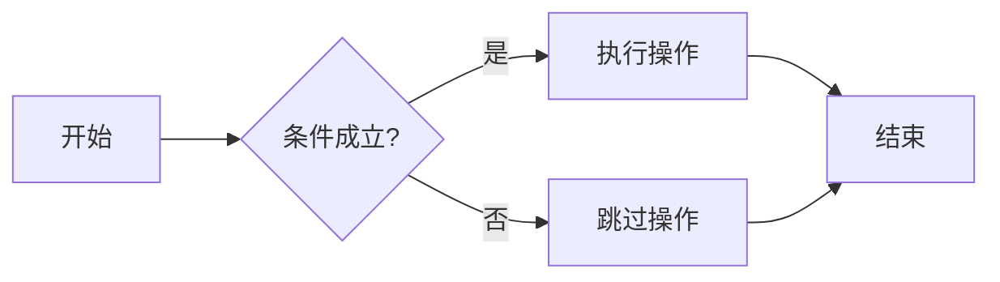
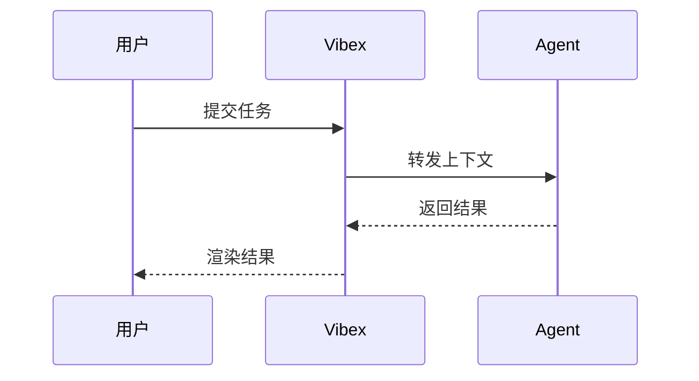
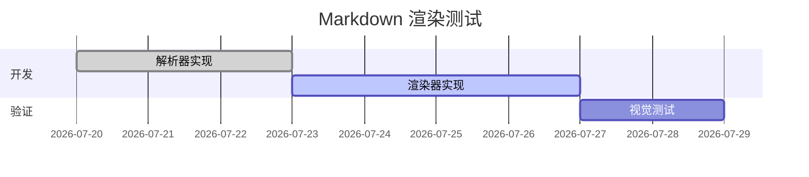
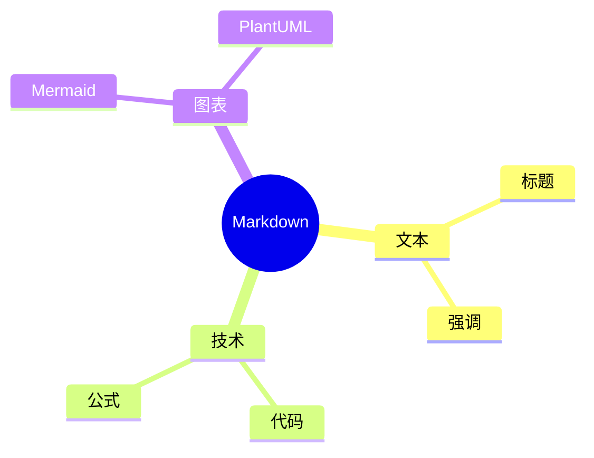
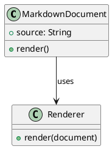
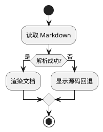
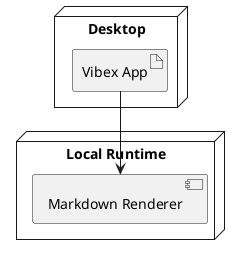
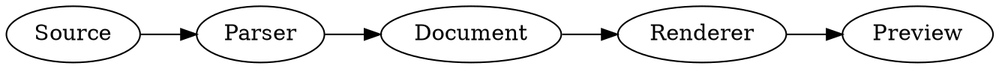

# Markdown 完整渲染测试

本文档用于测试基础 Markdown、GFM、LaTeX、图表及 HTML 扩展语法的渲染效果。

## 1. 基础文本格式

### 标题

# 一级标题
## 二级标题
### 三级标题
#### 四级标题
##### 五级标题
###### 六级标题

### 文本样式

普通文本，**这是粗体**，*这是斜体*，***这是粗斜体***，~~这是删除线~~，<u>这是下划线</u>。

行内代码：`const answer = 42;`

## 2. 列表与引用

### 无序列表

- 使用减号的项目
- 第二个项目
  - 嵌套项目

+ 使用加号的项目
+ 第二个项目

* 使用星号的项目
* 第二个项目

### 有序列表

1. 第一步
2. 第二步
3. 第三步
   1. 子步骤一
   2. 子步骤二

### 任务列表

- [x] 已完成任务
- [ ] 未完成任务
- [x] 支持多个任务状态

### 块引用

> 这是一段块引用。
>
> > 这是嵌套块引用。

## 3. 代码与技术

### 普通代码块

```
这是一段没有指定语言的代码块。
特殊字符 < > & 应按代码原样显示。
```

### JavaScript 语法高亮

```javascript
function greet(name) {
  console.log(`Hello, ${name}!`);
}

greet("Vibex");
```

### Rust 语法高亮

```rust
fn main() {
    let message = "Hello, Vibex!";
    println!("{message}");
}
```

### Diff 语法高亮

```diff
 fn greeting() -> &'static str {
-    "Hello"
+    "Hello, Vibex"
 }
```

## 4. 链接与媒体

超链接：[Vibex 仓库示例链接](https://github.com/)

本地图片：

自动链接：<https://www.example.com>

自动邮箱链接：<hello@example.com>

## 5. 表格与辅助

### 表格

| 功能 | 语法 | 状态 |
|:---|:---:|---:|
| 粗体 | `**text**` | 支持 |
| 斜体 | `*text*` | 支持 |
| 删除线 | `~~text~~` | 支持 |

### 分割线

分割线上方。

---

分割线下方。

### 脚注

这句话包含一个脚注引用[^1]，以及另一个命名脚注[^rendering]。

[^1]: 这是第一个脚注的内容。
[^rendering]: 这是用于测试脚注跳转和返回行为的内容。

## 6. 数学公式（LaTeX）

行内公式：质能方程 $E = mc^2$，勾股定理 $a^2 + b^2 = c^2$。

块级公式：

$$
f(x) = \frac{1}{\sqrt{2\pi\sigma^2}}
\exp\left(-\frac{(x-\mu)^2}{2\sigma^2}\right)
$$

矩阵：

$$
A =
\begin{bmatrix}
a_{11} & a_{12} \\
a_{21} & a_{22}
\end{bmatrix}
$$

## 7. 图表与绘图

### Mermaid 流程图



### Mermaid 时序图



### Mermaid 甘特图



### Mermaid 思维导图



### PlantUML 类图



### PlantUML 活动图



### PlantUML 部署图



### Graphviz（DOT）网络图



### Vega 柱状图

```vega
{
  "$schema": "https://vega.github.io/schema/vega/v5.json",
  "width": 360,
  "height": 180,
  "padding": 5,
  "data": [
    {
      "name": "table",
      "values": [
        {"category": "文本", "amount": 28},
        {"category": "代码", "amount": 42},
        {"category": "图表", "amount": 35}
      ]
    }
  ],
  "scales": [
    {"name": "xscale", "type": "band", "domain": {"data": "table", "field": "category"}, "range": "width", "padding": 0.2},
    {"name": "yscale", "domain": {"data": "table", "field": "amount"}, "nice": true, "range": "height"}
  ],
  "axes": [
    {"orient": "bottom", "scale": "xscale"},
    {"orient": "left", "scale": "yscale"}
  ],
  "marks": [
    {
      "type": "rect",
      "from": {"data": "table"},
      "encode": {
        "enter": {
          "x": {"scale": "xscale", "field": "category"},
          "width": {"scale": "xscale", "band": 1},
          "y": {"scale": "yscale", "field": "amount"},
          "y2": {"scale": "yscale", "value": 0},
          "fill": {"value": "#3b82f6"}
        }
      }
    }
  ]
}
```

### Vega-Lite 数据可视化

```vega-lite
{
  "$schema": "https://vega.github.io/schema/vega-lite/v5.json",
  "description": "各类 Markdown 内容数量",
  "data": {
    "values": [
      {"type": "基础文本", "count": 12},
      {"type": "代码", "count": 8},
      {"type": "图表", "count": 9},
      {"type": "扩展语法", "count": 7}
    ]
  },
  "mark": "bar",
  "encoding": {
    "x": {"field": "type", "type": "nominal", "title": "类型"},
    "y": {"field": "count", "type": "quantitative", "title": "数量"},
    "color": {"field": "type", "type": "nominal", "legend": null}
  }
}
```

## 8. 扩展语法与交互

### 警告与提示块

> [!INFO]
> 这是一条信息提示，用于测试 `INFO` 类型。

> [!NOTE]
> 这是一条普通备注。

> [!TIP]
> 这是一条有用建议。

> [!IMPORTANT]
> 这是一条重要信息。

> [!WARNING]
> 这是一条警告信息。

> [!CAUTION]
> 这是一条需要谨慎处理的信息。

### 折叠块

<details>
<summary>点击展开详细内容</summary>

这里是折叠区域中的 **Markdown 内容**。

- 折叠列表项目一
- 折叠列表项目二

</details>

### 高亮与标注

这句话包含 ==需要高亮显示的文本==，以及 HTML 标注 <mark>备用高亮文本</mark>。

### 表情符号

短代码表情：`:smile:` :smile: `:rocket:` :rocket: `:warning:` :warning:

原生 Emoji：😀 🚀 ⚠️ ✅

### 上下标

扩展语法：x^2^，H~2~O。

普通文本写法：`x^2`，`H_2O`。

HTML 写法：x<sup>2</sup>，H<sub>2</sub>O。

### HTML 嵌入

<div>
  <strong>这是 div 中的粗体内容。</strong>
  <span>这是 span 中的行内内容。</span>
</div>

下面的 iframe 用于测试安全策略；安全渲染器通常应阻止它或显示降级内容：

<iframe src="https://www.doubao.com" title="iframe 渲染测试" width="480" height="180"></iframe>

## 测试结束

当上述内容均能正常显示或按安全策略明确降级时，整体 Markdown 渲染测试完成。
